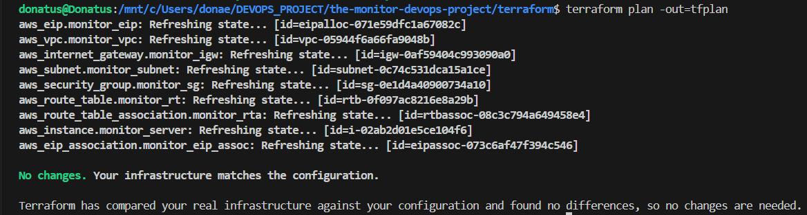
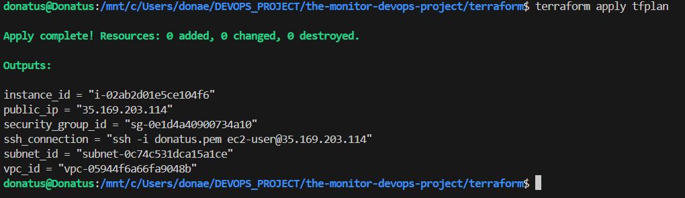
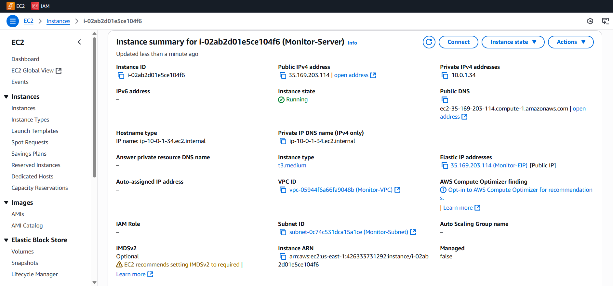
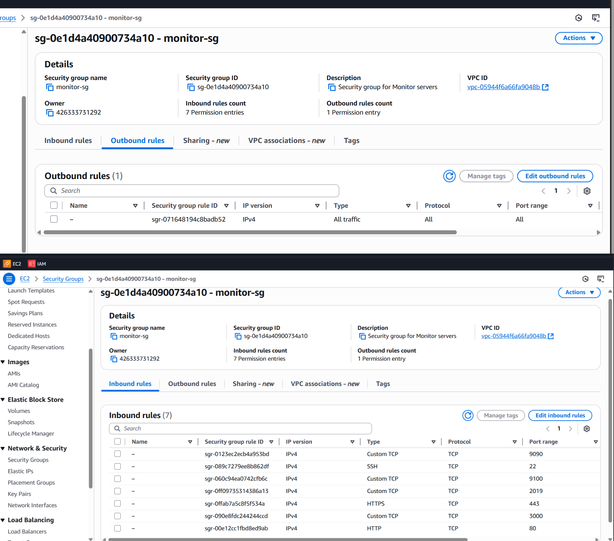
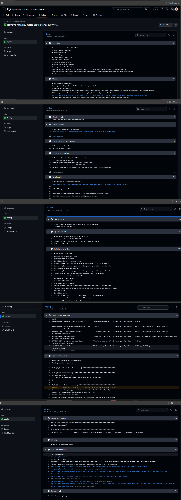
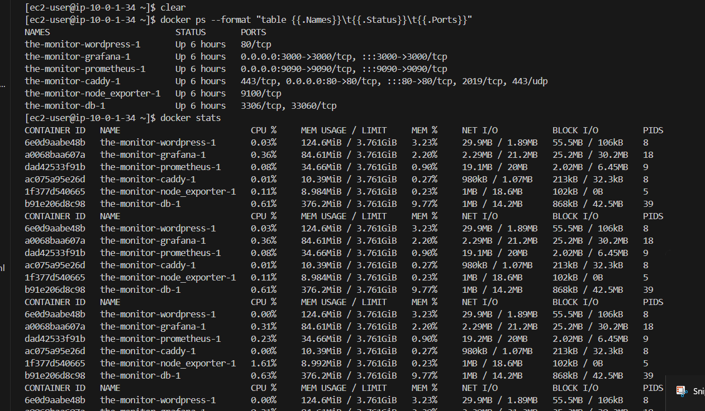
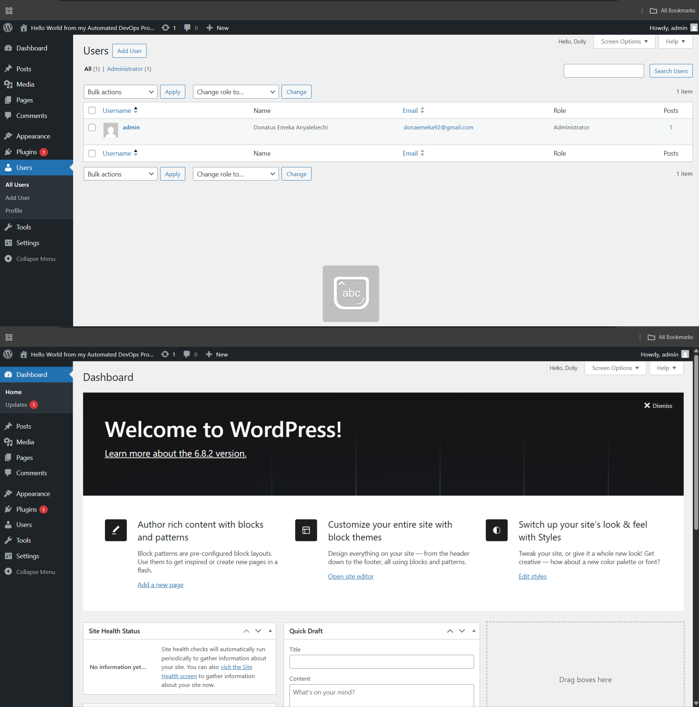
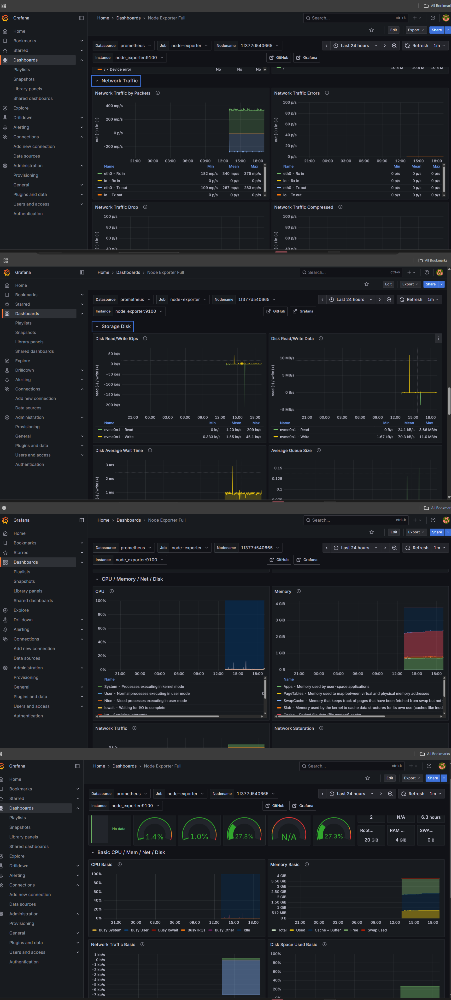
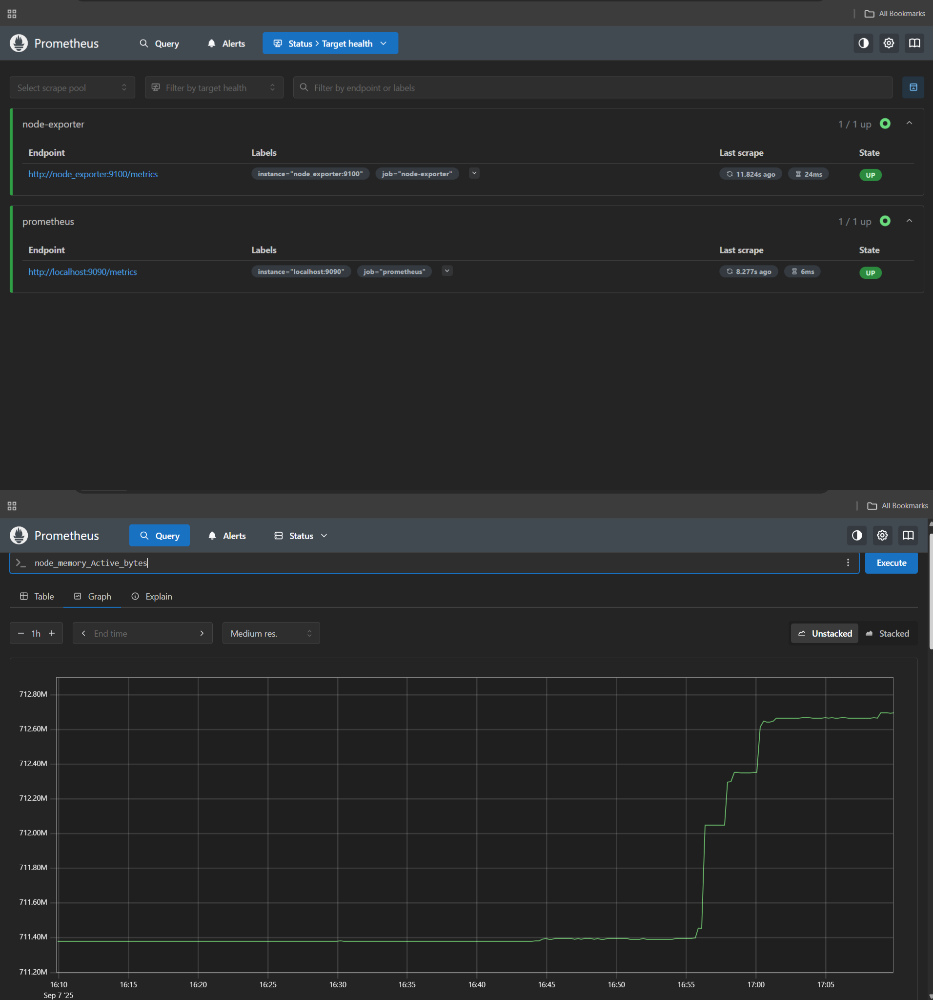
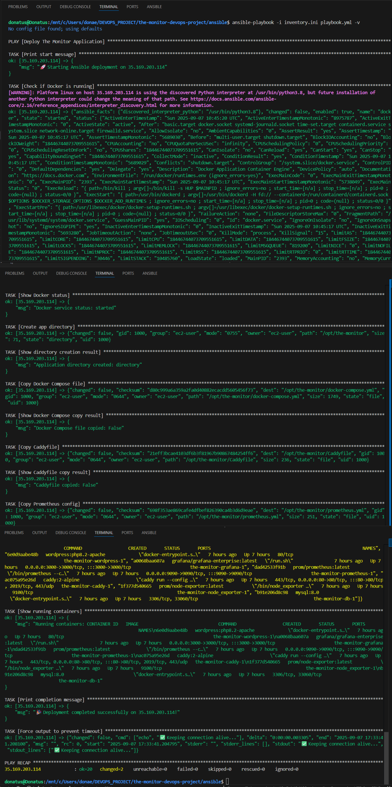

## The Monitor Project

this is a comprehensive monitoring solution built with **Docker**, featuring **WordPress**, **Prometheus**, **Grafana**, and a **Caddy reverse proxy**. This project provides a complete **infrastructure-as-code solution** for deploying a monitoring stack on **AWS**, demonstrating key DevOps practices.

## 🎯 Project Overview

**Why the project:**  

As organizations move to cloud-native architectures, having visibility into system performance becomes crucial. This project was born from the need to create a comprehensive monitoring solution that is both easy to deploy and maintain, while demonstrating modern DevOps practices.

### What does it include?

A complete monitoring stack featuring:

- Prometheus: Metrics collection

- Grafana: Visualization

- WordPress: Sample application

    All containerized and deployed on AWS using Infrastructure as Code principles.s.

### Who is it for?  
it was Designed for developers and operations teams who need better visibility into their applications and infrastructure without the complexity of enterprise solutions.

---
## 📸 Screenshots

### Infrastructure Provisioning

*Terraform plan showing infrastructure changes*

*Successful Terraform apply completion*

*EC2 instance running in AWS console*

*Security group configuration with proper rules*

### CI/CD Pipeline

*Successful GitHub Actions CI/CD pipeline*

### Application Deployment

*All Docker containers running successfully*

*WordPress application live and accessible*

### Monitoring Stack

*Grafana monitoring dashboard with system metrics*

*Prometheus collecting and storing metrics*

### Configuration Management

*Ansible playbook execution output*

## 📋 Prerequisites

Before deploying, ensure you have:

1.  AWS Account with appropriate permissions

2. AWS CLI configured with credentials

3. SSH Key Pair named "yourkeypair" in AWS us-east-1 region

4. GitHub Repository for CI/CD pipeline

5. GitHub Secrets configured:

   - AWS_ACCESS_KEY_ID

   - AWS_SECRET_ACCESS_KEY

   - SSH_PRIVATE_KEY

## Quick Start

## Manual Deployment

1. Clone the repository:

   - git clone https://github.com/donaemeka/the-monitor-devops-project.git

   - cd the-monitor-devops-project

2. Initialize Terraform:

  - cd terraform
  - terraform init

3. Deploy Infrastructure:

  - terraform plan
  - terraform apply -auto-approve

4. Deploy Applications:

- export SERVER_IP=$(terraform output -raw public_ip) ansible-playbook -i "$SERVER_IP," ansible/playbook.yml \--private-key=~/.ssh/yourkeypair.pem \ -u ec2-user

## Automated Deployment (CI/CD)

The project includes a GitHub Actions workflow that automatically deploys on push to the main branch:

1. Push to main branch

2. GitHub Actions triggers deployment

3. Infrastructure is provisioned with Terraform

4. Applications are deployed with Ansible

5. Monitoring stack is started with Docker Compose

## Infrastructure Components

## Terraform Modules

- VPC: Isolated network environment (10.0.0.0/16)

- Subnet: Public subnet for EC2 instance (10.0.1.0/24)

- Security Group: Controls inbound/outbound traffic

- EC2 Instance: t3.medium instance with Amazon Linux 2

- Elastic IP: Static public IP address

- S3 Backend: Remote state storage with encryption

- Internet Gateway: Internet connectivity for VPC

## Network Configuration

- VPC CIDR: 10.0.0.0/16

- Subnet CIDR: 10.0.1.0/24

- Availability Zone: us-east-1a

- Open Ports: 22 (SSH), 80 (HTTP), 443 (HTTPS), 3000 (Grafana), 9090 (Prometheus), 9100 (Node Exporter)

## Application Components

## Docker Services

- Caddy: Reverse proxy and SSL termination (ports 80, 443)

- WordPress: Content management system (port 80 internal)

- MySQL: Database for WordPress (port 3306 internal)

- Prometheus: Metrics collection and storage (port 9090)

- Grafana: Metrics visualization and dashboards (port 3000)

- Node Exporter: System metrics collection (port 9100)

- cAdvisor: Container metrics collection (port 8080)

## Docker Compose Structure

## yaml

version: '3.8'

services:

  caddy:        # Reverse proxy - ports 80, 443

  wordpress:    # WordPress CMS - port 80 (internal)

  db:           # MySQL database - port 3306 (internal)

  prometheus:   # Monitoring - port 9090

  grafana:      # Dashboards - port 3000

  node_exporter: # System metrics - port 9100

  cadvisor:     # Container metrics - port 8080

## 📊 Monitoring Stack

## Prometheus Metrics

- Node Metrics: CPU, memory, disk, network usage

- Container Metrics: Docker container performance

- Application Metrics: WordPress performance

- Custom Metrics: Application-specific monitoring

## Grafana Dashboards

## Pre-configured dashboards for:

- System Overview: CPU, memory, disk, network

- Docker Containers: Container performance metrics

- WordPress: Application performance and usage

- Business Metrics: Custom business KPIs

## 🚀 Deployment

## Manual Steps

1. Infrastructure Provisioning:

   - cd terraform
   - terraform init
   - terraform apply -auto-approve

2. Application Deployment:

   - ansible-playbook -i "${SERVER_IP}," ansible/playbook.yml \--private-key=~/.ssh/yourkeypair.pem \-u ec2-user

3. Verification:

  - ssh -i ~/.ssh/yourkeypair.pem ec2-user@${SERVER_IP} "docker ps"

## CI/CD Pipeline

The GitHub Actions workflow automates:

- Terraform Setup: Initializes and plans infrastructure

- AWS Configuration: Sets up S3 bucket for state storage

- Infrastructure Deployment: Creates VPC, EC2, security groups

- Ansible Setup: Installs required dependencies

- Application Deployment: Deploys Docker containers

- Verification: Checks service health

## Access URLs

After deployment, access the services at:

## Service	                                      URL	                                            Default Credentials

- WordPress	               ---             http://your-elastic-ip/	                ---               Setup during first access

- Grafana	                 ---          http://your-elastic-ip:3000                 ---                        admin / admin123

- Prometheus	             ---          http://your-elastic-ip:9090	                ---                       None

- Caddy Admin	             ---          http://your-elastic-ip:2019	                ---                         None

## To get the Elastic IP:

- cd terraform
- terraform output public_ip

## ⚠️ Challenges & Solutions

## Challenge 1: Terraform State Management

    - Problem: Terraform state file stored locally, not suitable for team collaboration

    - Solution: Implemented S3 backend with encryption for remote state storage

    - Technical Details: Configured S3 bucket with versioning and server-side encryption

## Challenge 2: CI/CD Pipeline Reliability

    - Problem: GitHub Actions workflow failing due to timing issues and dependencies

    - Solution: Added proper waiting mechanisms and dependency management

    - Technical Details: Implemented SSH connection retries and service health checks

## Challenge 3: Docker Permission Issues

    - Problem: Non-root user unable to run Docker commands without sudo

    - Solution: Automated user addition to docker group in Ansible playbook

    - Technical Details: Used usermod command and proper group management

## Challenge 4: Service Discovery

    - Problem: Containers unable to communicate due to network issues

    - Solution: Implemented Docker custom network and proper service naming

    - Technical Details: Created monitor-net bridge network with DNS resolution

## Challenge 5: Resource Optimization

    - Problem: Memory and CPU overallocation on EC2 instance

    - Solution: Right-sized instance type and implemented resource limits

    - Technical Details: Selected t3.medium with burstable CPU credits

## Challenge 6: Security Hardening

    - Problem: Excessive port exposure and insecure defaults

    - Solution: Minimal port exposure and secure configuration practices

    - Technical Details: Security group with least privilege principles

## Technical Decisions

- Terraform: Declarative, modular, provider ecosystem

- Ansible: Agentless, idempotent, readable YAML

- Docker Compose: Simplified orchestration, local dev friendly

- Stack Benefits: Cost-effective, scalable, maintainable, observable

##  Skills Demonstrated

## DevOps Practices

- DevOps: Terraform, Ansible, Docker Compose, CI/CD

- Cloud: AWS EC2, VPC, Security Groups, S3

- Technical: Bash, YAML, Linux, Docker, Networking

- Soft: Problem-solving, documentation, architecture, troubleshooting

## Troubleshooting

## Common Issues

1. SSH Connection Failed

   - Verify the SSH key is named "yourkeypairname" in AWS

   - Check security group allows SSH (port 22)

2. Terraform Errors

   - Ensure AWS credentials are properly configured

   - Verify S3 bucket name is unique

3. Docker Containers Not Starting

   - Check disk space on EC2 instance

   - Verify Docker daemon is running

5. Services Not Accessible

   - Check security group rules

   -mVerify containers are running: docker ps

## Logs Inspection

# Docker logs

- ssh -i ~/.ssh/keypairname.pem ec2-user@${SERVER_IP} "docker logs <container_name>"

# System logs

- ssh -i ~/.ssh/donatus.pem ec2-user@${SERVER_IP} "journalctl -u docker"

# Application logs

- ssh -i ~/.ssh/donatus.pem ec2-user@${SERVER_IP} "cd /opt/the-monitor && docker-compose logs"

## MAINTENANCE

Regular Tasks

1. Backup WordPress Content:

# Backup database

- ssh -i ~/.ssh/donatus.pem ec2-user@${SERVER_IP} \"docker exec -t $(docker ps -q -f name=db) mysqldump -u wpuser -pwppassword wordpress > backup.sql"

# Backup uploads
- ssh -i ~/.ssh/donatus.pem ec2-user@${SERVER_IP} \"tar -czf uploads.tar.gz /opt/the-monitor/wordpress_data/wp-content/uploads"

2. Update Docker Images:

- ssh -i ~/.ssh/donatus.pem ec2-user@${SERVER_IP} \ "cd /opt/the-monitor && docker-compose pull && docker-compose up -d"

3. Monitor Disk Space:

- ssh -i ~/.ssh/donatus.pem ec2-user@${SERVER_IP} "df -h"

## Scaling

To scale WordPress containers:

- ssh -i ~/.ssh/donatus.pem ec2-user@${SERVER_IP} \"cd /opt/the-monitor && docker-compose up -d --scale wordpress=3"

## 🚀 Future Enhancements

- Short-term: HTTPS, S3 backups, alerts, health checks

- Medium-term: Multi-AZ, auto-scaling, CloudFront, RDS

- Long-term: Kubernetes migration, service mesh, multi-region, DR

## Development Setup

# Test Terraform locally

- cd terraform

- terraform init

- terraform plan

# Test Ansible locally

ansible-playbook -i localhost, ansible/playbook.yml --connection=local 

## Docker Compose Local:

- docker-compose up -d

## Note: 

This project is for educational and demonstration purposes. For production use, please ensure proper security hardening, backup strategies, and monitoring.

## 👨‍💻 About the Author

Hi, I am Donatus Emaka Anyalebechi, a State-Certified DevOps Engineer (Germany)and Ironhack DevOps Graduate.

Experienced with AWS, Kubernetes, Terraform, Ansible, CI/CD pipelines, and monitoring stacks.

🔍 Open to Junior DevOps Engineer roles to contribute skills in cloud infrastructure, automation, and monitoring.

📧 Email: donaemeka92@gmail.com

linkedin.com/in/donatus-devops
